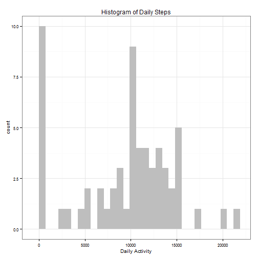
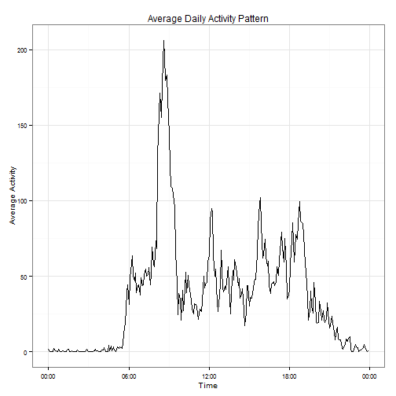
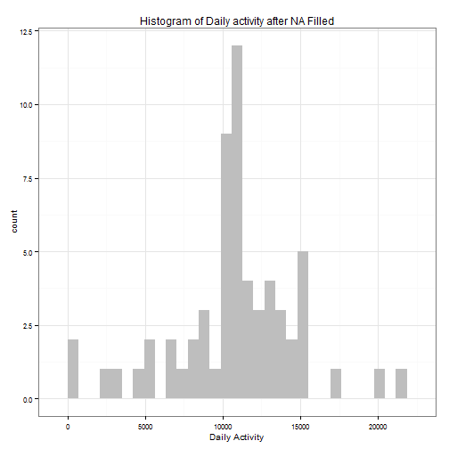
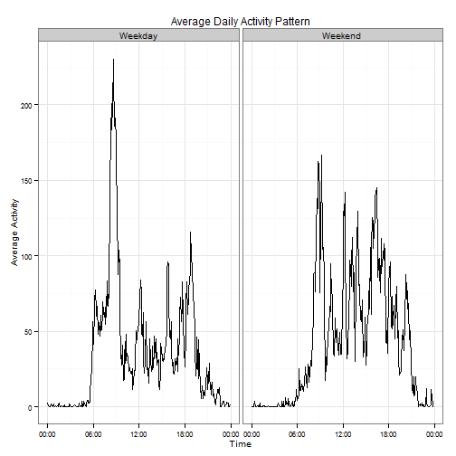

Reproducible Research: Peer Assessment 1
========================================================
 Author: Ziwen Yu  
 Date: 2015-03-12
 ---

## Loading and preprocessing the data
Load packages for data loading and transforming

```r
library(data.table)
library(lubridate)
```

Loading data

```r
Dt = fread("activity.csv")  # Read Data
```


Combine date and time to a new column (datetime)  
Add column (time) for formated 5 min interval in a day. This is for the convenience in calculating average daily activity pattern. 

```r

Dt$date = ymd(Dt$date)  # Convert to date type
# combine date and time part
Dt[, `:=`(datetime, date + hours(interval%/%100) + minutes(interval%%100))]
# Convert 5 min interval to datetime format
Dt[, `:=`(time, ymd("2015-02-01") + hours(interval%/%100) + minutes(interval%%100))]
```


## What is mean total number of steps taken per day?
Summarize steps by date

```r
Daily_step = Dt[, sum(steps, na.rm = TRUE), by = list(date)]
names(Daily_step)[2] = c("Num_steps")
```


Plot a histogram for daily steps summarized in the last step

```r
library(ggplot2)
library(scales)
Plot_theme = theme_bw() + theme(plot.title = element_text(size = 12), axis.title.x = element_text(size = 10), 
    axis.title.y = element_text(size = 10), axis.text.x = element_text(size = 8), 
    axis.text.y = element_text(size = 8))

ggplot(data = Daily_step) + geom_histogram(aes(Num_steps), fill = "grey") + 
    Plot_theme + labs(title = "Histogram of Daily Steps", x = "Daily Activity")
```

 


Calculate the mean and median value of the daily steps

```r
mean(Daily_step$Num_steps)  # Mean
median(Daily_step$Num_steps)  # Median
```

```
## [1] 9354
```

```
## [1] 10395
```


## What is the average daily activity pattern?

Take the average steps by time in a day and plot the time series

```r
# Take mean aggregation
Daily_Ptn = Dt[, mean(steps, na.rm = T), by = list(time)]
names(Daily_Ptn)[2] = "Step_mean"

# Plot time series
ggplot(data = Daily_Ptn) + geom_line(aes(x = time, y = Step_mean, group = 1)) + 
    scale_x_datetime(labels = date_format(format = "%H:%M")) + Plot_theme + 
    labs(title = "Average Daily Activity Pattern", x = "Time", y = "Average Activity")
```

 

Find the maximum number of steps in the daily step pattern

```r
# Time with max step
format(Daily_Ptn$time[which.max(Daily_Ptn$Step_mean)], format = "%H:%M")
```

```
## [1] "08:35"
```


## Imputing missing values
Find how many NA observations in the data set

```r
sum(is.na(Dt$steps))
```

```
## [1] 2304
```


Use the average daily activity pattern value to fill the missing observations according to its time in a day

```r
# filling missing data by inverval average step
Dt1 = merge(Dt, Daily_Ptn, by = c("time"), all.x = T)
Dt1[, `:=`(Complete_Step, ifelse(!is.na(steps), steps, Step_mean))]
```


Plot a new histogram of daily steps with NA records filled

```r
# summarize daily steps
Com_Daily_step = Dt1[, sum(Complete_Step), by = list(date)]
names(Com_Daily_step)[2] = "Num_steps"

# Plot histogram
ggplot(data = Com_Daily_step) + geom_histogram(aes(Num_steps), fill = "grey") + 
    Plot_theme + labs(title = "Histogram of Daily activity after NA Filled", 
    x = "Daily Activity")
```

 


Calculate mean and median of daily steps with NA records filled

```r
mean(Com_Daily_step$Num_steps)  # Mean
median(Com_Daily_step$Num_steps)  # Median
```

```
## [1] 10766
```

```
## [1] 10766
```


## Are there differences in activity patterns between weekdays and weekends?

Add factor column to differenciate weekday and weekend

```r
Dt1[, `:=`(Wday, as.factor(ifelse(wday(date) == 7 | wday(date) == 1, "Weekend", 
    "Weekday")))]
```


Plot the step time series of 5 min interval in a day with panel on "weekday" and "weekend"

```r
Daily_Ptn_wd = Dt1[, mean(Complete_Step), by = list(Wday, time)]
names(Daily_Ptn_wd)[3] = "Step_mean"

# Plot activity pattern time series on panel of weekday and weekend
ggplot(data = Daily_Ptn_wd) + geom_line(aes(x = time, y = Step_mean, group = 1)) + 
    scale_x_datetime(labels = date_format(format = "%H:%M")) + facet_grid(. ~ 
    Wday) + Plot_theme + labs(title = "Average Daily Activity Pattern", x = "Time", 
    y = "Average Activity")
```

 


The pattern of average daily activity patterns ware different between weekday and weekend. In weekdays, from 6:00 to 8:35 is a peak period when people wake up and go to work. However, in weekend, this peak period is disolved in the whole day time which makes its pattern much smoother than the weekday's.


