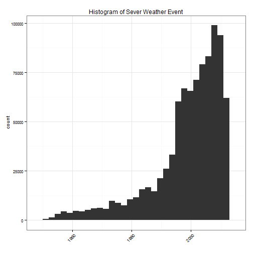
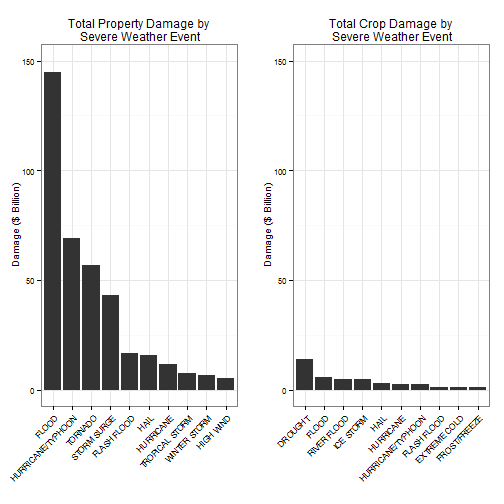
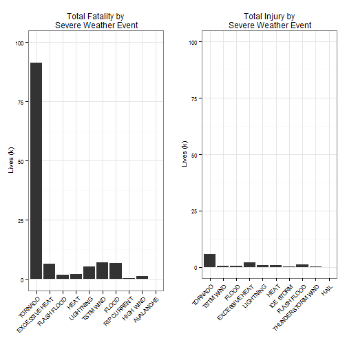

## Analysis of severe weather events' impact on public health and economy in the United States using NOAA storm database

### Synonpsis  
In this report, a assessment of severe weather events' impact on public health and economy will be conducted. The analysis is based on the storm database collected from the U.S. National Oceanic and Atmospheric Administration's (NOAA) from 1950 - 2011. The goal is to find the most harmful weather events for both public health and economy. Public health impact includes fatalities and injuries. Economy losss contains property and crop damages. From these data, we found that tornado is the most harmful weather event with respect to both fatality and injury, while flood, drought cause the most economic loss for property and crop, respectively.

### Basic settings


```r
library(data.table)
library(lubridate)
library(reshape2)
library(ggplot2)
library(scales)
library(gridExtra)
Plot_theme = theme_bw() + theme(plot.title = element_text(size = 12), axis.title.x = element_text(size = 10), 
    axis.title.y = element_text(size = 10), axis.text.x = element_text(size = 8, 
        angle = 45, hjust = 1), axis.text.y = element_text(size = 8))
```


### Data Processing

####- Step 1: Download and decompress file 


```r
setwd("E:\\Classes\\Data Scientist Certificate\\Reproducible Research\\Project\\Project 2\\")
if (!file.exists("repdata-data-StormData.csv.bz2")) download.file("https://d396qusza40orc.cloudfront.net/repdata%2Fdata%2FStormData.csv.bz2", 
    destfile = "repdata-data-StormData.csv.bz2")
if (!file.exists("repdata-data-StormData.csv")) bunzip2("repdata-data-StormData.csv.bz2", 
    overwrite = T, remove = F)
```


####- Step 2: Read file and choose the necessary fields for further analysis

```r
# Read data from csv file and choose the necessary fields for further
# analysis
setwd("E:\\Classes\\Data Scientist Certificate\\Reproducible Research\\Project\\Project 2\\")
if (!"Storm" %in% ls()) Storm = read.csv("repdata-data-StormData.csv", sep = ",", 
    stringsAsFactors = F)
dim(Storm)
```

```
## [1] 902297     37
```

The data contains 902297 rows and 37 columns. 

####- Step 3: Prelimiary analysis on data 

```r
mycol <- c("BGN_DATE", "EVTYPE", "FATALITIES", "INJURIES", "PROPDMG", "PROPDMGEXP", 
    "CROPDMG", "CROPDMGEXP")
Storm1 <- Storm[mycol]
Storm1$BGN_DATE = mdy_hms(Storm1$BGN_DATE)

ggplot(data = Storm1) + geom_histogram(aes(year(BGN_DATE))) + xlab("") + ggtitle("Histogram of Sever Weather Event") + 
    Plot_theme
```

```
## Warning: position_stack requires constant width: output may be incorrect
```

 

  
The data coverage spans from 1950 to 2011. Before 1990, there are generally fewer events recorded. 

####- Step 4: Calculate the monetory amount of economic loss
To know the monetory amount of economic loss, we need to find all symbols in both **PROPDMGEXP** and **CROPDMGEXP** columns, and generate a dataframe contains the unique symbols and their corresponding multiplier based on the description in [Storm Data Documentation](https://d396qusza40orc.cloudfront.net/repdata%2Fpeer2_doc%2Fpd01016005curr.pdf).

```r
# Function to get the monetary scale by DMGEXP
DMGScale = data.frame(DMGEXP = unique(c(unique(Storm1$PROPDMGEXP), unique(Storm1$CROPDMGEXP))), 
    Scale = c(3, 6, 0, 9, 6, NA, 0, 5, 6, NA, 4, 2, 3, 2, 7, 2, NA, 1, 8, 3))
DMGScale
Dmgscl = function(x) DMGScale$Scale[which(DMGScale$DMGEXP == x)]
```

```
##    DMGEXP Scale
## 1       K     3
## 2       M     6
## 3             0
## 4       B     9
## 5       m     6
## 6       +    NA
## 7       0     0
## 8       5     5
## 9       6     6
## 10      ?    NA
## 11      4     4
## 12      2     2
## 13      3     3
## 14      h     2
## 15      7     7
## 16      H     2
## 17      -    NA
## 18      1     1
## 19      8     8
## 20      k     3
```

Function *Dmgscl()* is then used to find the corresponding multiplier for calculating the monetory amount of economic loss.

```r
# Get the monetary amount of Damage
Storm1$PropDMG_Dollar = apply(Storm1[, c("PROPDMG", "PROPDMGEXP")], 1, function(x) (as.numeric(x[1]) * 
    10^Dmgscl(x[2])))

Storm1$CropDMG_Dollar = apply(Storm1[, c("CROPDMG", "CROPDMGEXP")], 1, function(x) (as.numeric(x[1]) * 
    10^Dmgscl(x[2])))
```

####- Step 5: Summarize the impacts on both public health and economy by event type and manipulate data format for plotting

```r
# Summary the public health and economic loss by event type
DMG = data.table(Storm1[, c("EVTYPE", "FATALITIES", "INJURIES", "PropDMG_Dollar", 
    "CropDMG_Dollar")])

Results = DMG[, lapply(.SD, sum, na.rm = TRUE), by = EVTYPE]

# Prepare for plotting format
PlotDt = melt(Results, id.vars = "EVTYPE")
```


### Results
We will find the top 10 most harmful severe weather events for both public health and economic impact in this section. 

The following pair of plots shows the results for property damage and crop damage by severe weather events.

```r

# scale on y axis
Scl = c(0, ceiling(max(Results$PropDMG_Dollar, Results$CropDMG_Dollar)/1e+09/50) * 
    50)
# Top 10 EVTYPE on property damage
TopTYPE = Results$EVTYPE[order(Results$PropDMG_Dollar, decreasing = T)[1:10]]
PropDMGPlot = ggplot(data = PlotDt[PlotDt$variable == "PropDMG_Dollar", ], aes(x = reorder(EVTYPE, 
    -value), y = value/1e+09)) + geom_bar(stat = "identity") + xlab("") + ylab("Damage ($ Billion)") + 
    ggtitle("Total Property Damage by\n Severe Weather Event") + xlim(TopTYPE) + 
    ylim(Scl) + Plot_theme

# Top 10 EVTYPE on crop damage
TopTYPE = Results$EVTYPE[order(Results$CropDMG_Dollar, decreasing = T)[1:10]]
CropDMGPlot = ggplot(data = PlotDt[PlotDt$variable == "CropDMG_Dollar", ], aes(x = reorder(EVTYPE, 
    -value), y = value/1e+09)) + geom_bar(stat = "identity") + xlab("") + ylab("Damage ($ Billion)") + 
    ggtitle("Total Crop Damage by\n Severe Weather Event") + xlim(TopTYPE) + 
    ylim(Scl) + Plot_theme

grid.arrange(PropDMGPlot, CropDMGPlot, ncol = 2)
```

 

  Based on the histograms above, we find that **flood** and **drought** cause most property damage and crop damage, respectively, in the United States based on the data provided.

The following pair of plots shows the results for fatality and injury by severe weather events.

```r
# Scale on y axis
Scl = c(0, ceiling(max(Results$FATALITIES, Results$INJURIES)/1000/50) * 50)
# Top 10 EVTYPE
TopTYPE = Results$EVTYPE[order(Results$FATALITIES, decreasing = T)[1:10]]

FATAPlot = ggplot(data = PlotDt[PlotDt$variable == "INJURIES", ], aes(x = reorder(EVTYPE, 
    -value), y = value/1000)) + geom_bar(stat = "identity") + ylab("Lives (k)") + 
    xlab("") + ggtitle("Total Fatality by\n Severe Weather Event") + xlim(TopTYPE) + 
    ylim(Scl) + Plot_theme


TopTYPE = Results$EVTYPE[order(Results$INJURIES, decreasing = T)[1:10]]
INJPlot = ggplot(data = PlotDt[PlotDt$variable == "FATALITIES", ], aes(x = reorder(EVTYPE, 
    -value), y = value/1000)) + geom_bar(stat = "identity") + ylab("Lives (k)") + 
    xlab("") + ggtitle("Total Injury by\n Severe Weather Event") + xlim(TopTYPE) + 
    ylim(Scl) + Plot_theme


grid.arrange(FATAPlot, INJPlot, ncol = 2)
```

 

  Based on the histograms above, we find that **tornado** causes biggest impact on both fatality and injury in the United States based on the data provided.

### Conclusion

From these data, we found that **tornado** is the most harmful weather event that impairs the public health for both fatality and injury. Economy-wise, **flood** and **drought** cause most property damage and crop damage, respectively.
